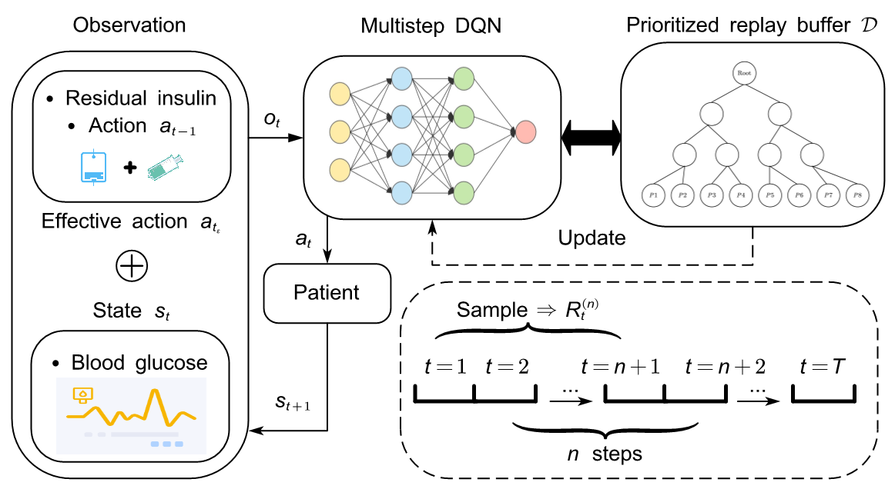

# An Improved Strategy for Blood Glucose Control Using Multi-Step Deep Reinforcement Learning
Senquan Wang, Weiwei Gu

Arxiv: https://arxiv.org/abs/2403.07566


## Environment
Our work is based on Basu et al. thus the configuration of the environment can be found in the repository [On the Challenges of using Reinforcement Learning in Precision Drug Dosing: Delay and Prolongedness of Action Effects](https://github.com/sumanabasu/On-the-Challenges-of-using-Reinforcement-Learning-in-Precision-Drug-Dosing-Delay-and-Prolongedness-)
## Reproduction
### Training Models
To train an agent for the glucose control task, run

```
python .\main.py --Agent Multistep --PER --ns 16
```

## Citation
Welcome to cite our paper and use it in your research:
```
@misc{gu2024improved,
      title={An Improved Strategy for Blood Glucose Control Using Multi-Step Deep Reinforcement Learning}, 
      author={Weiwei Gu and Senquan Wang},
      year={2024},
      eprint={2403.07566},
      archivePrefix={arXiv},
      primaryClass={cs.AI}
}
```
